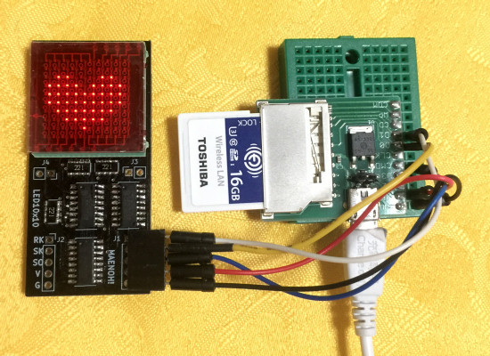

# Lua library for  LED10x10 with LT-5003D for FlashAir.

これはFlashAirで秋月電子の 10x10ドットマトリクスLED LT-5003Dを
Hideshi Maeno さんが作成されたLED基板(LED10x10)で制御するためのライブラリです。  
日本語表示も可能です。  
FlashAir W-04のファームウェア v4.00.03以降で動作します。  

10x10ドットマトリクスLED LT-5003Dについては以下をご参照ください。  
http://akizukidenshi.com/catalog/g/gI-00040/

## インストール方法  

    lib/SlibLT5003D.lua       -- ライブラリ  
    sample.lua            　  -- サンプルプログラム  
    sample_kanji.lua          -- 日本語サンプルプログラム  
上記をFlashAir内の好きな場所においてください  

## FlashAirとLED10x10基板のつなぎ方  

LED10x10基板の電源は +5Vです。  
FlashAirと共通の3.3V電源でも動作するようですが、保証の限りではありません。  

FlashAir(Pin#) | LED10x10基板 | 備考
--- | --- | ---
CLK (5) |--- | Pull-down(10korm) to GND
CMD (2) |SI  |
DAT0(7) |SK  |
DAT1(8) |RK  |
DAT2(9) |--- |
DAT3(1) |--- |
VCC (4) |--- | 2.7～3.6V
VSS(3,6)|G   | GND
---     |V   | 5V

## 表示パタンデータの説明  

表示パターンは要素10の配列に 1行ずつ格納します。  
各要素は、10bitで文字の上端がMSB、下端がLSBで、点灯は1、消灯は0とします。  
例えば、10x10ドットの”F"  

    ..........  
    @@@@@@@@..  
    @@@@@@@@..  
    @@........  
    @@........  
    @@@@@@....  
    @@@@@@....  
    @@........  
    @@........  
    @@........  

を表示する場合は、下記のように格納します。  

    bitmap	= {}  
    bitmap[ 1] = 0x1FF -- 0111111111  
    bitmap[ 2] = 0x1FF -- 0111111111  
    bitmap[ 3] = 0x198 -- 0110011000  
    bitmap[ 4] = 0x198 -- 0110011000  
    bitmap[ 5] = 0x198 -- 0110011000  
    bitmap[ 6] = 0x198 -- 0110011000  
    bitmap[ 7] = 0x180 -- 0110000000  
    bitmap[ 8] = 0x180 -- 0110000000  
    bitmap[ 9] = 0x000 -- 0000000000  
    bitmap[10] = 0x000 -- 0000000000  

## SlibLT5003D.lua の関数の説明  

関数 | 説明  
--- | ---  
SlibLT5003D:setup(n_disp) | Slib14SEGx8:setup(n_disp,led_type) | **FlashAirの端子をSPIに切り替えて、LEDの表示をクリアします** **n_disp:** LED10x10基板の接続個数 
SlibLT5003D:write(bitmap) |**ビットマップデータをLEDに転送します** **bitmap:** ビットマップデータ
SlibLT5003D:cls() | **LEDの表示をクリアします**

## サンプルコード  

sample.lua          -- ハートマークを表示します  
sample_kanji.lua    -- 10x10フォントを使って日本語メッセージを表示します  

### 日本語フォントを使う方法

日本語フォントを使う場合は、下記のレポジトリをご参照ください。  
https://github.com/AoiSaya/FlashAir_SlibJfont  

例として、"sample_kanji.lua"を実行する手順を以下に示します。  
上記レポジトリから以下のファイルを入手してFlashAirに保存します。  

    lib/SlibJfont.lua  -- ライブラリ  
    lib/Utf8Euc_jp.tbl -- UTF-8をEUC-JPに変換する際の変換テーブル  
    font/bdf2sef.lua   -- ファイル形式変換プログラム  

### サンプル用フォントの入手
[M+ BITMAP FONTS](http://mplus-fonts.osdn.jp/mplus-bitmap-fonts/download/index.html)から  
mplus_bitmap_fonts-2.2.4.tar.gz をダウンロードして解凍し、下記ファイルをfont/ の下に置きます。  
    mplus_f10r.bdf  
    mplus_j10r.bdf  

次に bdf2sef.lua を編集して、末尾に  

    convBdf2Bin("mplus_f10r.bdf")  
    convBdf2Bin("mplus_j10r.bdf")  
    
を追加してください。  
bdf2sef.lua を実行すると、font/ の下に "mplus_f10r.sef" と "mplus_j10r.sef"が生成されます。  
この状態で "sample_kanji.lua" を実行すると、LED上に日本語が表示されます。  

## Licence  

[MIT](/LICENSE)  

## Author  

[GitHub/AoiSaya](https://github.com/AoiSaya)  
[Twitter ID @La_zlo](https://twitter.com/La_zlo)  
